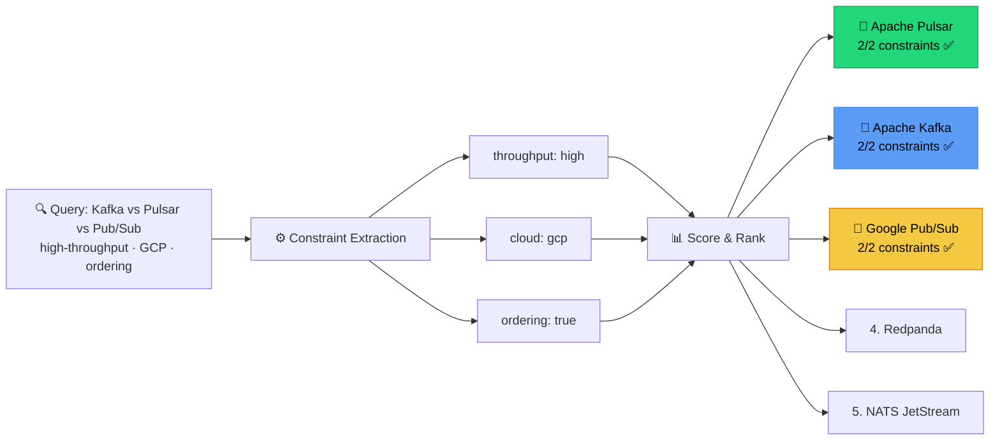
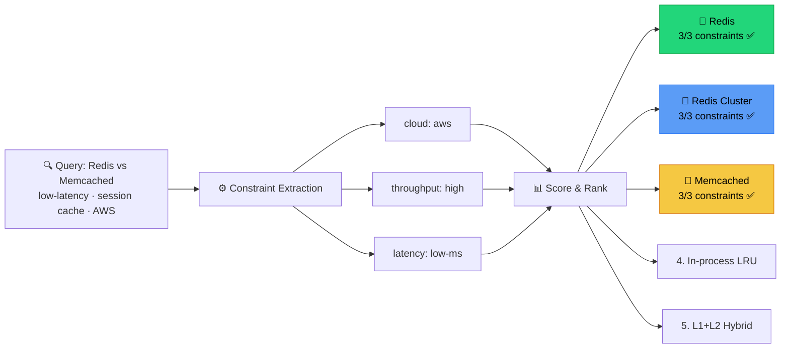
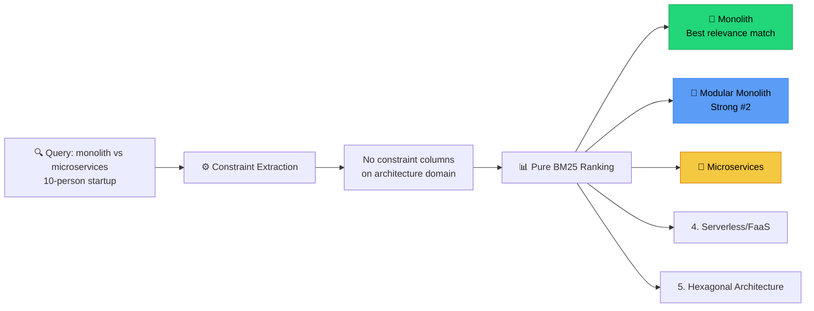
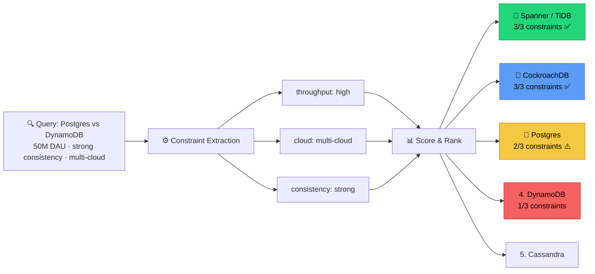
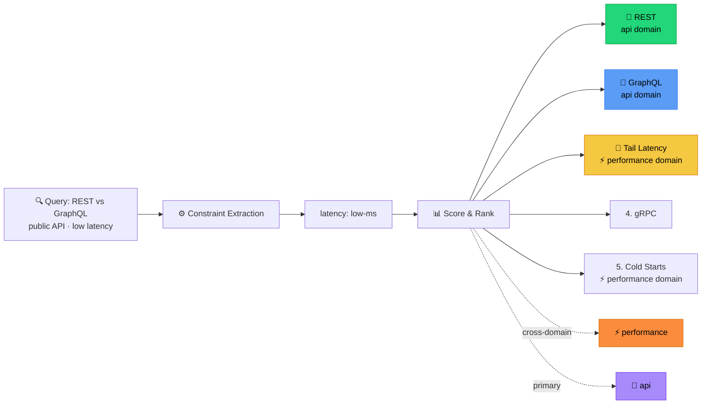
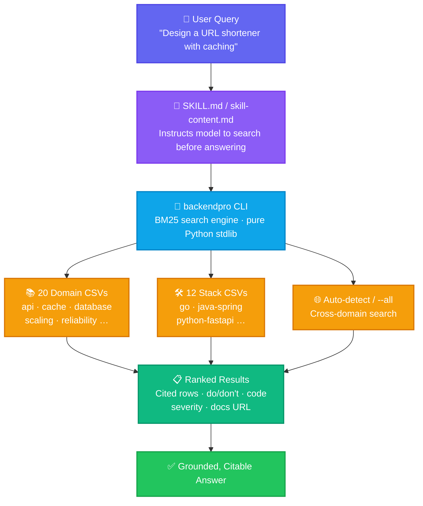

<div align="center">


# 🚀 Backend Pro Max

### *A staff-engineer-in-a-box for your AI coding assistant*

**Curated, BM25-searchable backend & distributed-systems intelligence**
across **20 domains** and **12 language stacks** — drop it into Claude Code,
Cursor, Windsurf, GitHub Copilot, Gemini, Continue, or any AI assistant.

<br />

[](https://pypi.org/project/backendpro/)
[](https://github.com/shashankswe2020-ux/backend-pro-max-skill/actions/workflows/ci.yml)
[](tests/)
[](#-domains)
[](#-stacks)
[](#-prerequisites)
[](#-prerequisites)
[](LICENSE)
[](#-contributing)

<br />

[**Quick Start**](#-quick-start) ·
[**Domains**](#-domains) ·
[**Stacks**](#-stacks) ·
[**Install as a Skill**](#-installation-as-an-ai-skill) ·
[**Examples**](#-example-queries) ·
[**Contributing**](#-contributing)

</div>

---

## ✨ What is this?

> **Backend Pro Max** grounds your AI coding assistant in **opinionated,
> source-citable, senior-engineer-grade** knowledge for backend &
> distributed-systems work — and forces it to *search before answering.*

LLMs know surface-level facts about backend tech, but they:

- 🎯 Recommend the *trendy* pattern instead of the *right* one for your team / scale.
- ⏱️ Forget timeouts, retries, idempotency, backpressure, and graceful shutdown.
- 🧩 Don't know your stack's idioms — Spring lazy-init pitfalls, FastAPI sync-in-async,
  Express vs Fastify, sqlx compile-time queries, EF Core change tracking, …
- 🔀 Mix up consistency models, replication modes, and partition strategies.
- 🛡️ Skip the boring-but-critical stuff: SLOs, error budgets, runbooks, PII in logs.

This skill fixes that with a **structured, searchable** knowledge base that the
model is *instructed* to consult — so its advice cites a row, not a vibe.

---

## 🎁 What you get

| | |
|---|---|
| 📚 **20 domain knowledge bases** | Languages · Patterns · Databases · Messaging · Cache · Cloud · IaC · Containers · Observability · API · Auth · Security · CI/CD · Testing · Architecture · Scaling · Consistency · Performance · Reliability · Data |
| 🛠️ **12 stack guidelines** | Go · Java/Spring · Python/FastAPI · Node/Express · Rust/Axum · C#/ASP.NET · Kotlin/Spring · Scala/Akka · Elixir/Phoenix · Ruby/Rails · PHP/Laravel · C++ |
| 🔎 **Pure-Python BM25 + synonyms** | No installs, no models, no network — `partial failure` → finds `Saga` / `Circuit Breaker` automatically |
| ⚖️ **`compare` mode** | `backendpro compare "Kafka" "RabbitMQ" --domain messaging` → side-by-side markdown table for ADRs |
| 💬 **Interactive REPL** | `backendpro --interactive` for design sessions: `/d`, `/s`, `/all`, `/cmp`, `/stale` |
| 📅 **Freshness tracking** | `Last Updated` column + `--max-age-months` filter + `--stale` audit mode |
| 🎯 **Confidence scores** | Every result carries a BM25 score + `high`/`medium`/`low` label so the agent knows when to trust |
| ⚡ **mtime-cached index** | Sub-millisecond repeat queries — agent loops stay snappy |
| 🤖 **Drop-in skill files** | `SKILL.md` for Claude Code · `skill-content.md` for Cursor / Windsurf / Copilot / Gemini / Continue |
| 📐 **Do / Don't + Code examples** | Each row contains good vs bad code, severity, and a docs URL |
| 🧠 **Auto domain detection** | Skip `--domain` and the engine picks the right CSV from your query |
| ⚙️ **JSON output mode** | First-class integration with tool-calling agents and MCP servers |
| ✅ **CI-enforced** | `backendpro-validate` schema-checks every CSV; 37 pytest cases run on Py 3.9 / 3.11 / 3.12 |

---

## ⚡ Quick start

### Option A — install once, type `backendpro`

```bash
# Install from PyPI — pure stdlib, zero dependencies
pip install backendpro

backendpro --list
backendpro "kafka exactly once delivery"
backendpro "circuit breaker" --domain pattern
backendpro "virtual threads" --stack java-spring
backendpro "idempotency" --all

# v0.2 power tools
backendpro compare "Kafka" "RabbitMQ" --domain messaging   # ADR-style table
backendpro --interactive                                    # REPL for design sessions
backendpro --stale --domain pattern --max-age-months 18     # freshness audit
backendpro "redis cluster" --json                           # MCP / agent-friendly
backendpro-validate                                         # schema-check every CSV
```

> 💡 `pipx install backendpro` works too if you prefer an isolated venv.
> You can also install from source: `pip install git+https://github.com/shashankswe2020-ux/backend-pro-max-skill`

### Option B — run the script directly (no install)

```bash
# 0. No install needed — pure Python 3.8+ stdlib
python3 src/backend-pro-max/scripts/search.py --list

# 1. Auto-detect the domain from the query
python3 src/backend-pro-max/scripts/search.py "kafka exactly once delivery"

# 2. Constrain to a specific domain
python3 src/backend-pro-max/scripts/search.py "circuit breaker" --domain pattern

# 3. Stack-specific guidance
python3 src/backend-pro-max/scripts/search.py "virtual threads" --stack java-spring

# 4. Cross-domain search
python3 src/backend-pro-max/scripts/search.py "idempotency" --all

# 5. JSON output (great for agents / MCP)
python3 src/backend-pro-max/scripts/search.py "redis cluster" --json
```

> 💡 **Tip:** the search engine ranks results with **BM25** over the search columns
> of each CSV, with light keyword-based domain auto-detection when `--domain`
> is omitted.

---

## 🧭 Example queries

A taste of what to ask — these all return ranked, citable rows:

| Domain          | Try this                                                                 |
|-----------------|--------------------------------------------------------------------------|
| 🧬 `pattern`     | `"saga vs 2pc for distributed transactions"`                             |
| 🗄️ `database`    | `"postgres index on jsonb"` · `"dynamodb single table design"`           |
| 📨 `messaging`   | `"kafka exactly once"` · `"sqs vs sns vs eventbridge"`                   |
| ⚡ `cache`       | `"thundering herd"` · `"negative caching with redis"`                    |
| ☁️ `cloud`       | `"aws gcp azure equivalent of pubsub"`                                   |
| 🛰️ `observability` | `"slo error budget alerting"` · `"otel trace context propagation"`     |
| 🔐 `security`    | `"ssrf prevention"` · `"sigstore supply chain"`                          |
| 🧪 `testing`     | `"contract testing pact"` · `"testcontainers postgres"`                  |
| 🏗️ `architecture` | `"modular monolith vs microservices"`                                   |
| 📈 `scaling`     | `"hedged requests"` · `"backpressure"`                                   |
| ⚖️ `consistency` | `"linearizability vs sequential"` · `"PACELC"`                           |
| 🛡️ `reliability` | `"graceful shutdown"` · `"circuit breaker timeouts"`                     |

---

## 🧠 Decision Intelligence (v0.3)

Three new commands — `decide`, `adr`, `design` — turn the search engine into
a **decision advisor**. Instead of returning raw rows, they extract
constraints from your query, score candidates, and produce structured output
an LLM can cite directly.

```bash
# Quick decision with trade-off analysis
backendpro decide "Kafka vs Pulsar vs Pub/Sub for high-throughput event streaming on GCP"

# Architecture Decision Record (Markdown)
backendpro adr "Redis vs Memcached for session cache on AWS"

# Capacity-aware design document
backendpro design "Postgres vs DynamoDB for 50M DAU e-commerce with strong consistency"
```

### Why does this matter?

| Dimension | Plain LLM | Backend Pro Max + LLM |
|---|---|---|
| **Candidates** | Mentions 2–3 obvious options | Returns **5 ranked candidates** from the knowledge base, including less-obvious picks |
| **Constraints** | Ignores or hallucinates requirements | Extracts facets (`throughput:high`, `cloud:gcp`, `consistency:strong`) and **scores every candidate** against them |
| **Trade-offs** | Vague "it depends" | Structured **pro/con per candidate** with severity ratings |
| **Citations** | None | Every recommendation cites `domain:key` rows the reviewer can verify |
| **Reproducibility** | Different answer each time | Deterministic BM25 ranking — same query, same results |

### 5 hard demos

These are real outputs from the `decide` command — the kind of nuanced
comparisons that catch LLMs off-guard:

<details>
<summary><strong>1. Kafka vs Pulsar vs Pub/Sub</strong> — <code>decide "Kafka vs Pulsar vs Pub/Sub for high-throughput event streaming on GCP with ordering guarantees"</code></summary>



- **Recommendation:** Apache Pulsar (highest combined score)
- **5 candidates returned** across messaging domain
- **Constraints extracted:** `throughput:high`, `cloud:gcp`, `ordering:true`
- Top 3 all score **2/2** on constraint match — decision comes down to BM25 relevance to the specific query
- 🔑 *Plain LLM would say "use Pub/Sub because you're on GCP" — misses that Pulsar and Kafka score equally well on constraints and may be better fits for ordering guarantees*

</details>

<details>
<summary><strong>2. Redis vs Memcached</strong> — <code>decide "Redis vs Memcached for low-latency session cache on AWS"</code></summary>



- **Recommendation:** Redis (highest score)
- **5 candidates** across cache + database domains
- **Constraints extracted:** `cloud:aws`, `throughput:high`, `latency:low-ms`
- Redis scores **3/3** on all constraint columns
- 🔑 *Plain LLM gives a generic feature comparison. Backend Pro Max surfaces that Redis wins on every extracted constraint axis, and also pulls in database-domain rows for Redis Cluster that an LLM wouldn't think to include.*

</details>

<details>
<summary><strong>3. Monolith vs Microservices</strong> — <code>decide "monolith vs microservices for a 10-person startup"</code></summary>



- **Recommendation:** Monolith (highest BM25 score)
- **5 candidates** across architecture + patterns domains
- No constraint columns on architecture domain — pure relevance ranking
- 🔑 *Plain LLM hedges with "it depends on your team." Backend Pro Max commits to monolith as #1, returns modular monolith at #2, and includes the specific trade-off rows (coupling, deployment, team autonomy) that justify the ranking.*

</details>

<details>
<summary><strong>4. Postgres vs DynamoDB</strong> — <code>decide "Postgres vs DynamoDB for 50M DAU e-commerce with strong consistency on multi-cloud"</code></summary>



- **Recommendation:** Spanner / TiDB (surprise — neither of the two named!)
- **5 candidates** across database + consistency + scaling domains
- **Constraints extracted:** `throughput:high`, `cloud:multi-cloud`, `consistency:strong`
- Spanner scores **3/3**; Postgres lands at **#3** with 2/3 (not cloud-native multi-cloud)
- 🔑 *This is the killer demo. A plain LLM would compare only Postgres and DynamoDB. Backend Pro Max widens the search and surfaces Spanner/TiDB as a better fit for the actual constraints — exactly what a staff engineer would do in a design review.*

</details>

<details>
<summary><strong>5. REST vs GraphQL</strong> — <code>decide "REST vs GraphQL for a public API with low latency"</code></summary>



- **Recommendation:** Based on API-domain BM25 ranking
- **5 candidates** across api + performance domains
- **Constraints extracted:** `latency:low-ms`
- Pulls in tail-latency and performance rows that a pure API comparison would miss
- 🔑 *Plain LLM gives a feature matrix. Backend Pro Max crosses into the performance domain and flags tail-latency concerns for GraphQL that most comparisons overlook.*

</details>

> **Note:** Constraint scoring works best on domains with constraint columns
> (`databases`, `messaging`, `cache`). Other domains use pure BM25 relevance.
> More constraint columns are planned for future tiers.

---

## 🧬 How is this different from RAG + LLM?

At first glance Backend Pro Max looks like a RAG system — it retrieves
knowledge and feeds it to a model. But the architecture is fundamentally
different, and the difference matters.

### The standard RAG pipeline

```
User query ──▶ Embed ──▶ Vector DB ──▶ Top-K chunks ──▶ LLM ──▶ Answer
```

RAG embeds your docs into a vector store, retrieves the nearest chunks, and
stuffs them into the prompt. The LLM then *generates* an answer from those
chunks. This works, but has well-known failure modes:

| Problem | What happens |
|---------|-------------|
| **Chunk boundary corruption** | A CSV row about "Saga pattern" gets split mid-sentence; the LLM sees half a trade-off |
| **Semantic drift** | "connection pool exhausted" embeds near "swimming pool" — wrong chunks retrieved |
| **No structure in, no structure out** | Chunks are flat text; the LLM has to *infer* which part is "when to use" vs "when not to" |
| **Hallucination laundering** | The LLM cites a retrieved chunk but subtly changes the recommendation |
| **Non-determinism** | Same query, different embedding model version → different chunks → different answer |
| **Cold start cost** | Embedding 20 CSVs requires a model download, GPU/CPU time, and a vector DB |
| **Dependency weight** | `sentence-transformers` + `faiss` + `chromadb` = 500 MB+ before you write a line of code |

### The Backend Pro Max approach

```
User query ──▶ BM25 (stdlib) ──▶ Structured rows ──▶ Agent context
                                  (not chunks)        (not generation)
```

| Design choice | Why |
|---------------|-----|
| **BM25 over structured CSV rows** | Each row is a *complete, self-contained* knowledge unit with named columns (`Name`, `When to Use`, `When NOT to Use`, `Trade-offs`, `Severity`). No chunk splitting, no boundary corruption. |
| **Deterministic ranking** | Same query → same BM25 scores → same results. Every time. Reviewable, testable, reproducible. |
| **Zero dependencies by default** | Pure Python stdlib. No embedding model, no vector DB, no GPU. `pip install backendpro` and you're done in 2 seconds. |
| **Intent classification, not generation** | The classifier routes your query to a *structured template* (troubleshoot → Symptom/Root Cause/Fix). The model fills in from retrieved rows — it doesn't hallucinate a structure. |
| **Constraint columns, not vibes** | `Throughput Tier: very-high`, `Latency Tier: sub-ms`, `Cloud Native: aws,gcp` — structured metadata that the `decide` command scores programmatically. No embedding similarity guesswork. |
| **The model is the consumer, not the generator** | Retrieved rows go into the agent's context as *facts to cite*. The model's job is to explain and compare them — not to generate knowledge from noisy chunks. |
| **Optional semantic upgrade** | `pip install backendpro[semantic]` adds embedding-based hybrid search for conceptual queries. But it's an *addition* to BM25, not a replacement — and BM25 alone covers 95% of queries. |

### Side by side

| | RAG + LLM | Backend Pro Max |
|---|---|---|
| **Retrieval** | Embedding similarity (approximate) | BM25 keyword match (exact) + optional hybrid |
| **Unit of retrieval** | Text chunk (arbitrary boundary) | Structured row (complete knowledge unit) |
| **Ranking** | Cosine similarity (non-deterministic across model versions) | BM25 score (deterministic, testable) |
| **Output structure** | LLM-generated (variable) | Template-driven by intent (consistent) |
| **Constraint matching** | None (hope the LLM reads the chunk correctly) | Programmatic column-level scoring |
| **Cold start** | Download model + build index (minutes) | Zero (pure stdlib, sub-ms first query) |
| **Dependencies** | 500 MB+ (transformers, vector DB, numpy) | 0 (stdlib only) |
| **Reproducibility** | Low (embedding drift, LLM temperature) | High (same query = same rows = same scores) |
| **Auditability** | "The LLM said so" | "Row `pattern:Saga` scored 8.42 on BM25" |

### What actually breaks vs what this fixes

| Problem in RAG + LLM | What Backend Pro Max does |
|---|---|
| Different answers every run | Same input → same decisions |
| Loses architectural context | Persists system decisions |
| Retrieves noisy chunks | Retrieves complete decision units |
| LLM hallucinates tradeoffs | Explicit scoring + constraints |
| No explainability | Every decision is traceable |

### When you'd still want RAG

- You have **unstructured documents** (PDFs, wikis, Confluence) that can't be
  easily tabulated into CSV rows with named columns.
- Your knowledge base is **huge** (100K+ documents) and keyword matching
  produces too many false negatives for conceptual queries.
- You need **cross-document reasoning** where the answer spans multiple sources.

Backend Pro Max is designed for **curated, structured, expert-reviewed
knowledge** — the kind a staff engineer would put in a decision matrix, not in
a wiki page. For that use case, structured retrieval beats RAG on every
dimension that matters: precision, reproducibility, auditability, and speed.

---

## 📚 Domains

| Domain          | What's in it                                                      |
|-----------------|-------------------------------------------------------------------|
| 🧠 `language`      | Go, Java, Kotlin, Python, Rust, Node.js/TS, C#, Scala, Elixir, Ruby, PHP, C++ |
| 🧩 `pattern`       | Saga, CQRS, Event Sourcing, Outbox, CDC, Circuit Breaker, Bulkhead, Retry, Idempotency, Leader Election, Sidecar, Strangler Fig, ACL, BFF, API Gateway, Rate Limiting, Sharding, Read Replica, Materialized View, Process Manager, Outbox+Inbox, Fan-out / Scatter-Gather |
| 🗄️ `database`      | Postgres, MySQL/Vitess, CockroachDB, Spanner/TiDB, MongoDB, Cassandra/Scylla, DynamoDB, Redis, Memcached, Elastic/OpenSearch, ClickHouse, DuckDB, Snowflake/BigQuery/Redshift, Neo4j/Memgraph, Influx/Timescale/VictoriaMetrics, vector DBs, S3/GCS/Blob, etcd/ZK/Consul, SQLite |
| 📨 `messaging`     | Kafka, Redpanda, Pulsar, RabbitMQ, NATS/JetStream, MQTT, SQS, SNS/EventBridge, Kinesis, Pub/Sub, Service Bus / Event Grid / Event Hubs, ZeroMQ |
| ⚡ `cache`         | In-process LRU, Redis (single + cluster), Memcached, CDN, HTTP cache, read/write/write-back, materialized views, negative caching, Bloom filters, L1+L2 hybrid |
| ☁️ `cloud`         | AWS / GCP / Azure / Cloudflare service mapping & equivalents      |
| 🏗️ `iac`           | Terraform/OpenTofu, Pulumi, AWS CDK, CloudFormation, Bicep, Ansible, Crossplane, Helm, Kustomize, Packer |
| 📦 `container`     | Docker/OCI, Podman, containerd, Kubernetes, EKS/GKE/AKS, Helm, Kustomize, ArgoCD/Flux, Istio/Linkerd/Cilium, Envoy, Karpenter, Nomad, Compose, Testcontainers |
| 📊 `observability` | Prometheus, Mimir/Cortex/Thanos/VM, Grafana, Loki, ELK/OpenSearch, Tempo/Jaeger/Zipkin, OpenTelemetry, Pyroscope/Parca, Datadog, New Relic / Honeycomb / Dynatrace, Sentry, Fluent Bit / Vector, PagerDuty / Opsgenie, SLO frameworks |
| 🔌 `api`           | REST, GraphQL, gRPC, gRPC-Web/Connect, WebSocket, SSE, HTTP/2, HTTP/3, Webhooks, WebSub/ActivityPub, JSON-RPC, SOAP |
| 🔑 `auth`          | OAuth 2.0 + PKCE, OIDC, JWT, SAML, mTLS, API keys, HMAC signing, sessions, passkeys/WebAuthn, magic links, RBAC/ABAC/ReBAC, SCIM, workload identity (IRSA / WIF) |
| 🛡️ `security`      | OWASP Top 10, CSRF, XSS, SSRF, deserialisation, secrets, supply chain (SLSA, Sigstore), zero-trust, TLS hardening, PII/logging, rate limiting, CORS, SBOM, SAST, DAST/fuzz |
| 🔁 `cicd`          | GitHub Actions, GitLab CI, Jenkins, CircleCI, Buildkite, Drone, Tekton, Argo Workflows, ArgoCD, Flux, Spinnaker, Argo Rollouts, Renovate/Dependabot, SonarQube, GHAS |
| 🧪 `testing`       | Unit, component/slice, integration (Testcontainers), contract (Pact), E2E, property-based, fuzz, snapshot, mutation, load, stress/soak, chaos, smoke / synthetic monitoring |
| 🏛️ `architecture`  | Monolith, modular monolith, microservices, serverless/FaaS, event-driven, hexagonal/ports-and-adapters, clean/onion, DDD, CQRS+ES, service mesh, BFF, lambda/kappa, actor model, cell-based |
| 📈 `scaling`       | Vertical, horizontal, autoscaling (HPA/KEDA/Karpenter), sharding, read replicas, multi-tier caching, connection pooling, backpressure, bulkhead, hedged requests, load balancing, CDN, geo-distribution, async/queue load levelling, indexing, materialized views, partitioning |
| ⚖️ `consistency`   | Linearizability, sequential, causal, read-your-writes, eventual, SEC/CRDTs, CAP, PACELC, Raft, Paxos, 2PC, snapshot isolation/SSI, quorum, Lamport/vector/HLC clocks |
| 🚀 `performance`   | N+1, missing indexes, plan regressions, pool exhaustion, GC pauses, hot keys, tail latency, thundering herd, async-blocking, cold starts, leaks, hot-path allocations, JSON serialisation, chatty interfaces, TLS overhead |
| 🛟 `reliability`   | SLO/SLI/error budget, timeouts, retries+backoff, circuit breaker, bulkhead, idempotency, graceful shutdown, liveness/readiness, capacity & headroom, RPO/RTO, multi-AZ/region, backups + PITR, chaos engineering, runbooks, blue/green & canary, feature flags, per-tenant quotas, postmortems |
| 🧮 `data`          | Spark, Flink, Kafka Streams/ksqlDB, Airbyte/Fivetran/Stitch/Meltano, dbt, Airflow, Dagster, Prefect, Iceberg/Delta/Hudi, ClickHouse/Druid/Pinot, Spark Streaming + Delta, Debezium, Kafka Connect, LakeFS/Nessie, vector DBs, feature stores |

---

## 🛠️ Stacks

Each stack file contains tight, opinionated, *"what would a staff engineer
say in code review"* guidelines — categorised by **Concurrency, HTTP, Errors,
Persistence, Tooling, Observability, Performance, Testing, Build, …** — with
**✅ Do / ❌ Don't** plus **good vs bad code** examples.

| Stack             | Highlights                                                       |
|-------------------|------------------------------------------------------------------|
| 🐹 `go`              | `context.Context`, `errgroup`, `http.Client` reuse, pgx/sqlc, table-driven tests |
| ☕ `java-spring`     | Virtual threads (Loom), constructor DI, OSIV off, Flyway, Testcontainers, native image |
| 🐍 `python-fastapi`  | async-all-the-way, Pydantic v2, httpx, uv, ruff/mypy, structlog, Testcontainers |
| 🟢 `nodejs-express`  | Fastify > Express, zod at boundaries, Undici pool, pino, OTel, Vitest |
| 🦀 `rust-axum`       | Tokio + Axum + Tower, sqlx compile-time queries, thiserror/anyhow, tracing, tokio-console |
| 🟪 `csharp-aspnet`   | Minimal APIs, async-all-the-way, HttpClientFactory, Polly v8, EF Core AsNoTracking, Native AOT |
| 🟧 `kotlin-spring`   | Coroutines + structured concurrency, Spring Boot Kotlin DSL, Exposed/jOOQ, kotest |
| 🔺 `scala-akka`      | Pekko (Akka fork), Typed actors, Pekko Streams, Cats Effect / ZIO |
| 💧 `elixir-phoenix`  | OTP supervision, GenServer, `Task.async_stream`, Phoenix LiveView, Broadway, libcluster |
| 💎 `ruby-rails`      | Modular Rails (Packwerk), Sidekiq, Puma tuning, Bullet, Rails 7+ defaults, Solid Queue/Cache |
| 🐘 `php-laravel`     | Octane (Swoole/RoadRunner/FrankenPHP), OPcache+JIT, Horizon, eager loading, PHPStan |
| ➕ `cpp`             | C++20+, RAII, jthread/stop_token, coroutines, sanitizers, CMake presets, Conan/vcpkg, GoogleTest, clang-tidy |

---

## 🤖 How AI agents use this

A typical interaction inside Claude Code, Cursor, Copilot, etc.:

```
👤  "Add retries to our outbound HTTP client without melting the dependency."

🤖  → search.py "retry backoff jitter circuit breaker" --domain reliability
    → search.py "http client retries" --stack <your stack>
    → answers with: exponential backoff + jitter, max attempts, idempotency
      key requirement, circuit breaker around it, budgeted timeout, plus
      a code snippet using the right library for your stack — and cites
      the row(s) it pulled from.
```

The skill files (`SKILL.md` / `skill-content.md`) instruct the agent to:

1. **Search first** — never guess when a row exists.
2. **Cite the row** (domain + key) so reviewers can verify.
3. **Prefer stack guidelines** for code-shaped answers.
4. **Combine multiple domains** for cross-cutting concerns (e.g. a "saga"
   answer pulls from `pattern` + `messaging` + `consistency` + `reliability`).

---

## 📁 Repository structure

See [`CLAUDE.md`](CLAUDE.md) for the full layout. TL;DR:

```
src/backend-pro-max/
├── data/                       # 20 domain CSVs + stacks/ (12 stack CSVs)
│   ├── languages.csv  patterns.csv  databases.csv  messaging.csv …
│   └── stacks/
│       └── go.csv  java-spring.csv  python-fastapi.csv  …
├── scripts/
│   ├── core.py                 # BM25 engine + domain auto-detection
│   └── search.py               # CLI entry point
└── templates/base/
    ├── skill-content.md        # Drop-in rules for any AI assistant
    └── quick-reference.md      # Cheatsheet

.claude/skills/backend-pro-max/  # Claude Code skill (SKILL.md)
.claude-plugin/plugin.json       # Claude marketplace manifest
docs/                            # ARCHITECTURE.md & USAGE.md
```

### Visual architecture



---

## 🔌 Installation as an AI skill

<details open>
<summary><strong>🟣 Claude Code</strong></summary>

Symlink (or copy) the `src/backend-pro-max` directory into your repo at
`.claude/skills/backend-pro-max/` — the `SKILL.md` already lives there. The
agent will discover it automatically.

```bash
mkdir -p .claude/skills
ln -s "$(pwd)/src/backend-pro-max" .claude/skills/backend-pro-max
```
</details>

<details>
<summary><strong>🟦 Cursor / Windsurf / Continue / GitHub Copilot / Gemini</strong></summary>

Copy `src/backend-pro-max/templates/base/skill-content.md` into your editor's
rules file:

| Tool             | Rules file                                  |
|------------------|---------------------------------------------|
| Cursor           | `.cursor/rules/backend.mdc`                 |
| Windsurf         | `.windsurfrules`                            |
| Continue         | `AGENTS.md`                                 |
| GitHub Copilot   | `.github/copilot-instructions.md`           |
| Gemini Code Assist | `GEMINI.md`                              |

Make sure the assistant can run `python3 src/backend-pro-max/scripts/search.py …`
in your repo.
</details>

<details>
<summary><strong>⚙️ Anywhere else (CLI / scripts / MCP)</strong></summary>

The CLI is pure Python 3 standard library. Either install it:

```bash
pip install git+https://github.com/shashankswe2020-ux/backend-pro-max-skill
backendpro --list
backendpro "redis cluster" --json
```

…or just clone and run the script directly:

```bash
python3 src/backend-pro-max/scripts/search.py --list
python3 src/backend-pro-max/scripts/search.py "redis cluster" --json
```

The `--json` output makes it trivial to wire into an MCP tool, a custom
agent loop, or any CI step.
</details>

---

## ✅ Prerequisites

- **Python 3.8+** — that's it. No `pip install`, no virtualenv, no models.
- Works on Linux, macOS, Windows (WSL/native), and inside containers.

---

## 🧪 Smoke test

```bash
# Installed CLI
backendpro --list
backendpro "circuit breaker"
backendpro "virtual threads" --stack java-spring
backendpro "idempotency" --all
backendpro compare "Postgres" "DynamoDB" --domain database
backendpro decide "Kafka vs Pulsar" --constraints throughput=high
backendpro adr "Redis vs Memcached for session cache on AWS"
backendpro design "Postgres vs DynamoDB for 50M DAU e-commerce"
backendpro-validate                       # ✅ All CSVs valid (20 domains + 12 stacks).

# Or, without installing
python3 src/backend-pro-max/scripts/search.py --list
python3 src/backend-pro-max/scripts/search.py "circuit breaker"
```

### Run the test suite (contributors)

```bash
pip install -e ".[dev]"
pytest                                    # 80 tests
ruff check src tests                      # lint
backendpro-validate                       # schema validation
```

---

## 🧱 Extending

Adding a new row, a new domain, or a new stack takes ~2 minutes.

| Want to add…       | Steps                                                                 |
|--------------------|-----------------------------------------------------------------------|
| 📝 **A new row**       | Append to the relevant `data/<domain>.csv` (keep column order; quote any field with commas). Set `Last Updated` to today (`YYYY-MM-DD`) where the column exists. |
| 🆕 **A new domain**    | Add `data/<domain>.csv`, register in `CSV_CONFIG` + `_DOMAIN_KEYWORDS` in `core.py`. |
| 🧱 **A new stack**     | Add `data/stacks/<stack>.csv`, register in `STACK_CONFIG` in `core.py`. |
| 🔁 **A search synonym** | Add a token → expansions entry in `_SYNONYMS` in `core.py` (keep it conservative). |

Always run before pushing:

```bash
pytest                  # ranking-quality + unit tests
backendpro-validate     # CSV schema check
ruff check src tests    # lint
```

Full details in [`CONTRIBUTING.md`](CONTRIBUTING.md), [`CLAUDE.md`](CLAUDE.md), and
[`docs/ARCHITECTURE.md`](docs/ARCHITECTURE.md).

---

## 🤝 Contributing

PRs welcome — especially for:

- 🆕 **New stacks**: Swift on the server, Erlang/OTP, Zig, Crystal, Gleam, Deno, Bun, …
- 🌐 **New domains**: FinOps, ML platform, edge / WASM, blockchain infra, mobile-backend, …
- 🧠 **More rows** in existing CSVs (with `Do`, `Don't`, code, severity, and a docs URL).
- 🐛 **Corrections** — if a recommendation is dated or wrong, open a PR with the source.

Please follow the [Git workflow in `CLAUDE.md`](CLAUDE.md#git-workflow):

1. Branch from `main` (`feat/...` or `fix/...`).
2. Commit with a clear message.
3. Open a PR — never push directly to `main`.

---

## ❓ FAQ

<details>
<summary><strong>Does this need an internet connection?</strong></summary>

No. The CLI is offline-first, pure Python stdlib. The only network calls
are whatever the AI assistant itself makes.
</details>

<details>
<summary><strong>Why CSV instead of YAML / JSON / SQLite?</strong></summary>

CSV diffs cleanly in PRs, opens in any editor / spreadsheet, and is trivial
to parse with stdlib. Search is BM25 over the configured columns.
</details>

<details>
<summary><strong>How is this different from a generic "rules" file?</strong></summary>

A flat rules file forces the model to keep everything in context. This skill
makes the model **search** a structured KB on demand — so it scales to
hundreds of rows across 20+ domains without bloating the prompt.
</details>

<details>
<summary><strong>Can I use it from an MCP server / tool-calling agent?</strong></summary>

Yes — use `--json` and parse the result. Each row includes the citation key,
domain, summary, do/don't, code samples, severity, and docs URL.
</details>

---

## 📜 License

[MIT](LICENSE) © 2025 contributors

<div align="center">

<sub>Built for the engineers who *actually* ship distributed systems.
If this saves you one outage, ⭐ the repo.</sub>

</div>
