# Netflix — Staff-Engineer-Level System Design

> **ADR Status:** Accepted  
> **Author:** Backend Pro Max  
> **Date:** 2026-04-28  
> **Scope:** End-to-end high-level design of Netflix's streaming platform  
> **Interview Level:** Staff / Principal Engineer

---

## Table of Contents

1. [Requirements & Constraints](#1-requirements--constraints)
2. [Architecture Decision Records (ADRs)](#2-architecture-decision-records)
3. [High-Level Architecture](#3-high-level-architecture)
4. [Component Deep Dives](#4-component-deep-dives)
5. [Data Model](#5-data-model)
6. [API Design](#6-api-design)
7. [Scaling & Performance](#7-scaling--performance)
8. [Reliability & Fault Tolerance](#8-reliability--fault-tolerance)
9. [Observability](#9-observability)
10. [Security](#10-security)
11. [Cost Considerations](#11-cost-considerations)
12. [Interview Talking Points](#12-interview-talking-points)

---

## 1. Requirements & Constraints

### 1.1 Functional Requirements

| # | Requirement |
|---|-------------|
| FR-1 | Users browse a personalized catalogue of movies/series |
| FR-2 | Users search titles, actors, genres |
| FR-3 | Users press **Play** → adaptive-bitrate video streams to their device |
| FR-4 | Users manage profiles, watchlists, viewing history |
| FR-5 | Content is ingested, transcoded into hundreds of encoding variants, and deployed to CDN |
| FR-6 | Recommendations are personalized per-profile using ML models |
| FR-7 | Users receive push notifications for new releases |

### 1.2 Non-Functional Requirements

| # | Requirement | Target |
|---|-------------|--------|
| NFR-1 | Availability | 99.99 % (≈ 52 min downtime / year) |
| NFR-2 | Streaming start latency | < 2 s P99 |
| NFR-3 | Catalogue browse latency | < 200 ms P99 |
| NFR-4 | Scale | 260 M+ subscribers, 100 M+ concurrent streams at peak |
| NFR-5 | Multi-region | Active-active across ≥ 3 AWS regions + Open Connect PoPs in 6 000+ locations |
| NFR-6 | Bandwidth | Tens of Tbps aggregate peak egress |
| NFR-7 | Durability | Content master files ≥ 99.999999999 % (11 nines) |

### 1.3 Back-of-the-Envelope Estimates

```
260 M subscribers × ~2 hr/day avg watch = 520 M hours/day
Peak concurrent streams ≈ 100 M
Avg bitrate ≈ 5 Mbps → peak bandwidth ≈ 500 Tbps
(served almost entirely from Open Connect OCAs inside ISP networks)

Catalogue reads: 260 M users × 20 API calls/session × 1.5 sessions/day
             ≈ 7.8 B reads/day ≈ 90 K RPS avg, ~500 K RPS peak

Content library: ~17 000 titles × ~1 200 encoding variants ≈ 20 M files
Storage per title ≈ 100 GB (all variants) → ~1.7 EB total on CDN
```

---

## 2. Architecture Decision Records

### ADR-1: Two-Plane Architecture — Control Plane (AWS) + Data Plane (Open Connect)

| Field | Value |
|-------|-------|
| **Context** | Netflix needs to serve video at massive scale cheaply, while application logic (browse, search, recommendations) requires flexible cloud compute. |
| **Decision** | Split into **Control Plane** (all logic before "Play" — runs on AWS) and **Data Plane** (everything after "Play" — runs on Netflix Open Connect CDN). |
| **Rationale** | Generic compute (recommendations, API, search) benefits from AWS elasticity. Video delivery is Netflix-unique and benefits from custom hardware inside ISP networks (90 % traffic served locally). Reduces backbone cost by orders of magnitude. |
| **Alternatives Rejected** | (a) Pure third-party CDN — insufficient control & cost at scale. (b) Full self-hosted — loses AWS elasticity for control plane. |
| **Consequences** | Two independent scaling & deployment models. OCA fleet management becomes a logistics challenge. |

### ADR-2: Microservices with API Gateway (Zuul)

| Field | Value |
|-------|-------|
| **Context** | Hundreds of engineering teams ship independently. |
| **Decision** | Decompose into ~1 000 microservices behind Netflix Zuul (edge gateway) with service mesh (Eureka discovery, Ribbon client LB, Hystrix circuit breaker). |
| **Rationale** | Polyglot teams, independent deployments, isolated blast radius. Zuul handles auth, routing, canary, rate-limiting at edge. |
| **Alternatives Rejected** | Monolith — deployment coupling. Pure service mesh without gateway — no single TLS termination / auth point. |
| **Consequences** | Requires mature observability, contract testing, and platform team investment. Risk of distributed monolith mitigated by strict domain ownership. |

### ADR-3: EVCache (Memcached-Based) as Primary Caching Tier

| Field | Value |
|-------|-------|
| **Context** | Catalogue, user session, and recommendation data are read-heavy (100:1 read-to-write). |
| **Decision** | Use EVCache (Netflix's globally replicated Memcached wrapper) as the primary cache, fronting Cassandra/MySQL reads. |
| **Rationale** | Sub-millisecond reads; cross-region replication; battle-tested at Netflix scale (trillions of ops/day). |
| **Alternatives Rejected** | Redis Cluster — operational complexity at this scale; lack of Netflix-specific replication semantics. |
| **Consequences** | Cache invalidation complexity. Requires write-through + async cross-region replication. Stale reads bounded by TTL. |

### ADR-4: Apache Cassandra as Primary Operational Data Store

| Field | Value |
|-------|-------|
| **Context** | Viewing history, user profiles, bookmarks need always-available writes across regions. |
| **Decision** | Cassandra with tunable consistency (LOCAL_QUORUM for strong reads, LOCAL_ONE for availability-biased reads). |
| **Rationale** | AP system with tunable consistency; linear horizontal scaling; multi-DC replication built-in. Netflix operates one of the largest Cassandra deployments (tens of thousands of nodes). |
| **Alternatives Rejected** | DynamoDB — vendor lock-in for largest tables; PostgreSQL — single-leader won't handle multi-region active-active writes. |
| **Consequences** | Last-write-wins conflict resolution acceptable for profiles/history. Anti-entropy repair required. |

### ADR-5: Adaptive Bitrate Streaming with Per-Title Encoding

| Field | Value |
|-------|-------|
| **Context** | Content varies wildly in complexity (animation vs. action). Fixed encoding ladders waste bandwidth or quality. |
| **Decision** | Per-title (and now per-shot) encoding optimization. Generate a custom bitrate ladder per title using convex-hull analysis. Serve via MPEG-DASH / HLS with adaptive client. |
| **Rationale** | 20 % bandwidth savings with equal or better perceptual quality. Client switches renditions based on throughput, buffer, device capability. |
| **Consequences** | Transcoding pipeline must produce ~1 200 variants per title. Increased ingest compute cost offset by CDN bandwidth savings. |

### ADR-6: Chaos Engineering as First-Class Practice

| Field | Value |
|-------|-------|
| **Context** | At Netflix's scale, failures are constant. Must validate resilience continuously in production. |
| **Decision** | Chaos Monkey (random instance kills), Chaos Kong (simulate full region failure), FIT (Failure Injection Testing) in production. |
| **Rationale** | Only production traffic exercises real failure modes. Builds confidence in failover, circuit breakers, fallbacks. |
| **Consequences** | Requires investment in safe abort mechanisms, blast-radius controls, GameDay culture. |

---

## 3. High-Level Architecture

### 3.1 End-to-End System Overview

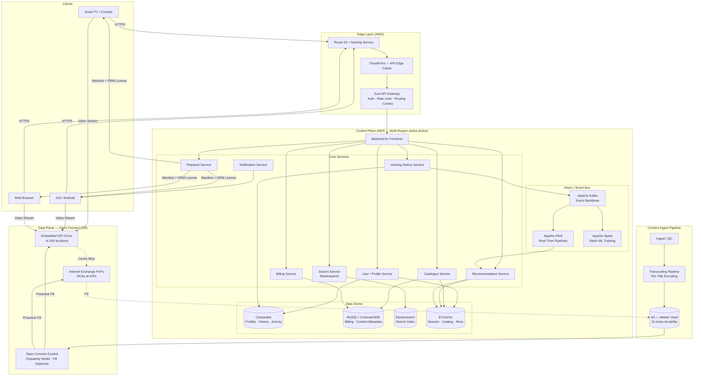

### 3.2 Request Flow — "Browse Home Page"

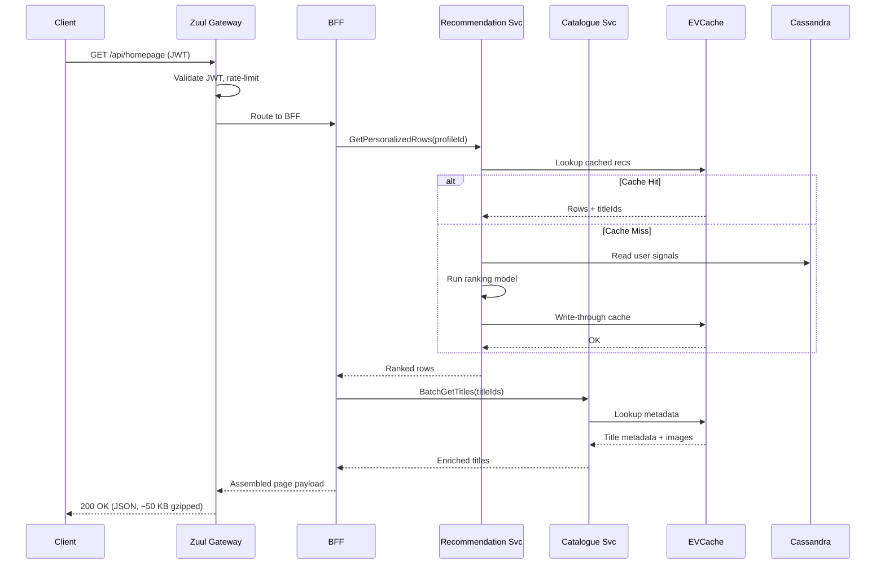

### 3.3 Request Flow — "Press Play"

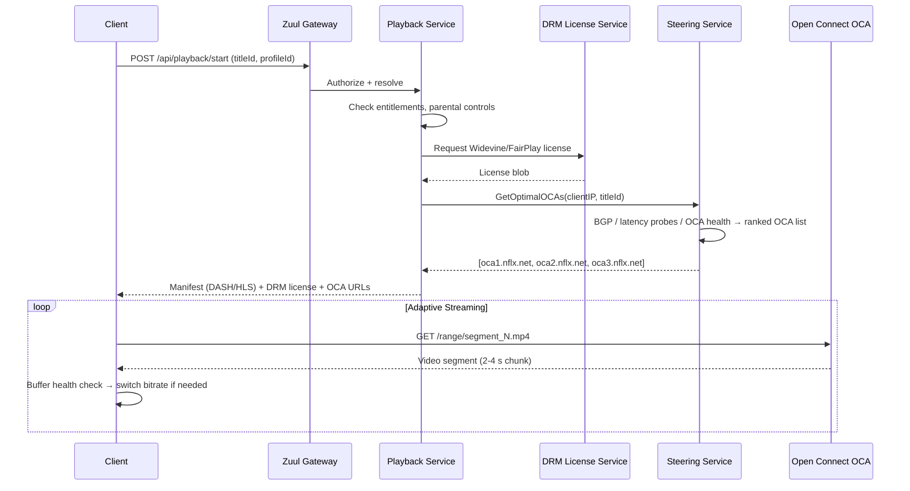

---

## 4. Component Deep Dives

### 4.1 API Gateway — Zuul 2

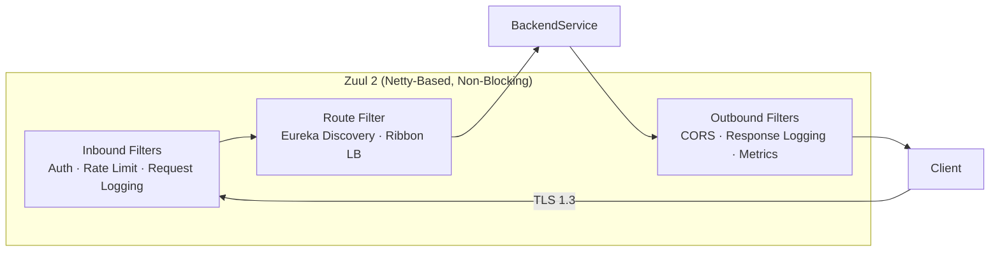

**Key design decisions:**
- Async non-blocking I/O (Netty) — handles 10 K+ conn/instance
- Filter chain is hot-reloadable (Groovy / polyglot) for zero-downtime policy changes
- Canary routing: 1 % → 5 % → 25 % → 100 % with automatic rollback on error-rate spike
- Cross-region routing for failover: Zuul detects region health and redirects traffic

### 4.2 Recommendation Engine

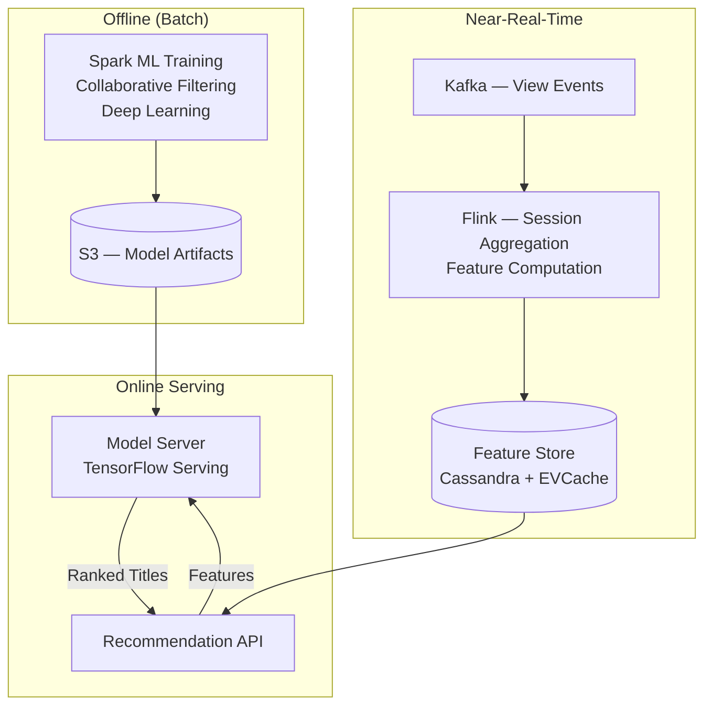

**Latency budget:** < 100 ms P99 for full ranking of ~2 000 candidates → 50 titles.

**Key techniques** (from Netflix tech blogs):
- **Two-pass ranking:** lightweight candidate generation (ANN / embedding similarity) → heavyweight ranking model (deep neural net)
- **Interleaving experiments:** real-time A/B test multiple algorithms simultaneously
- **Contextual bandits:** balance explore vs. exploit for new content

### 4.3 Content Delivery — Open Connect

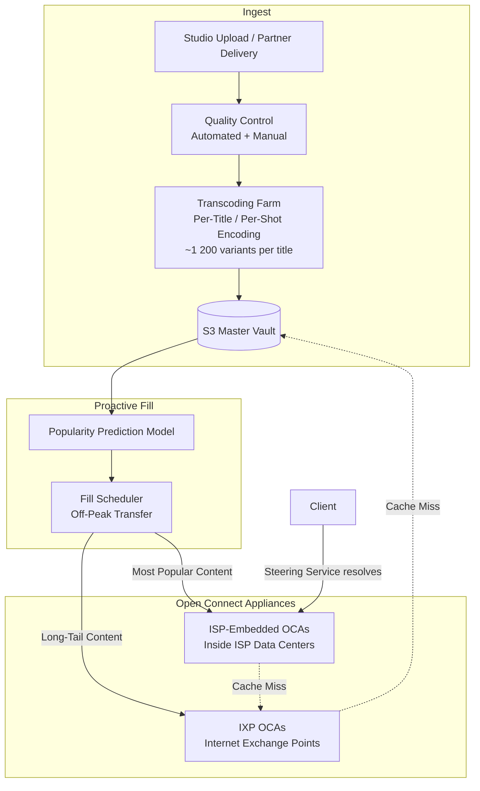

**OCA Hardware** (custom Netflix design):
- 100+ Gbps throughput per appliance
- 36 × 16 TB SSDs per storage-heavy OCA
- FreeBSD + custom TCP stack tuned for video delivery
- Consistent hashing for content placement across OCA cluster

**Fill strategy:**
- Top 20 % titles (by predicted popularity) → pushed to **all** ISP OCAs
- Remaining 80 % → available at IXP-level OCAs
- Off-peak overnight fill to avoid competing with live traffic

### 4.4 Data Stores Topology

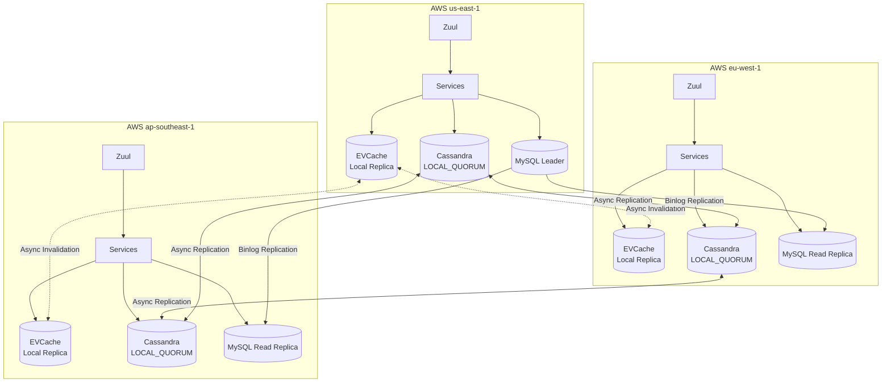

| Store | Use Case | Consistency | Replication |
|-------|----------|-------------|-------------|
| Cassandra | Profiles, history, bookmarks, activity | Tunable (LOCAL_QUORUM) | Multi-DC async |
| MySQL/CockroachDB | Billing, content metadata, licensing | Strong (leader writes) | Binlog → read replicas |
| EVCache | Session, catalogue cache, rec cache | Eventual (TTL-based) | Async cross-region |
| Elasticsearch | Title/actor/genre search | Eventual | Cross-cluster replication |
| S3 | Master content vault, ML model artifacts | Strong (read-after-write) | Cross-region replication |
| Kafka | Event backbone | Partition-ordered | MirrorMaker cross-region |

---

## 5. Data Model

### 5.1 Core Entities (Cassandra — Denormalized for Query Patterns)

```
// User Profile — partition by userId
user_profiles (
    user_id        UUID,          -- partition key
    profile_id     UUID,          -- clustering key
    display_name   TEXT,
    avatar_url     TEXT,
    maturity_level TEXT,
    language       TEXT,
    created_at     TIMESTAMP
)

// Viewing History — time-series, partition by profile, cluster by time desc
viewing_history (
    profile_id     UUID,          -- partition key
    watched_at     TIMESTAMP,     -- clustering key DESC
    title_id       UUID,
    progress_pct   FLOAT,
    device_type    TEXT,
    duration_sec   INT
)

// My List — per-profile watchlist
my_list (
    profile_id     UUID,          -- partition key
    added_at       TIMESTAMP,     -- clustering key DESC
    title_id       UUID,
    title_name     TEXT           -- denormalized for fast reads
)
```

### 5.2 Content Metadata (MySQL / CockroachDB — Relational)

```sql
titles (
    title_id       UUID PRIMARY KEY,
    title_type     ENUM('movie', 'series'),
    name           VARCHAR(500),
    release_year   INT,
    maturity_rating VARCHAR(10),
    synopsis       TEXT,
    duration_min   INT,              -- NULL for series
    created_at     TIMESTAMP
);

title_genres (
    title_id       UUID REFERENCES titles,
    genre_id       INT REFERENCES genres,
    PRIMARY KEY (title_id, genre_id)
);

encoding_variants (
    variant_id     UUID PRIMARY KEY,
    title_id       UUID REFERENCES titles,
    resolution     VARCHAR(10),      -- '4K', '1080p', '720p', etc.
    bitrate_kbps   INT,
    codec          VARCHAR(20),      -- 'AV1', 'H.265', 'VP9'
    file_size_mb   INT,
    s3_key         VARCHAR(500)
);
```

---

## 6. API Design

### 6.1 Key APIs

```
# Browse
GET  /api/v1/homepage?profileId={pid}
     → { rows: [{ title: "Trending", titles: [{id, name, img, synopsis}] }] }

# Search
GET  /api/v1/search?q={query}&profileId={pid}&page=0&size=20
     → { results: [{titleId, name, matchScore, img}], total, nextPage }

# Playback
POST /api/v1/playback/start
     Body: { titleId, profileId, deviceId }
     → { manifest_url, drm_license, oca_urls: [...], resume_position_ms }

POST /api/v1/playback/heartbeat
     Body: { sessionId, positionMs, bitrateKbps, bufferHealthMs }
     → 204

POST /api/v1/playback/stop
     Body: { sessionId, positionMs }
     → 204

# My List
POST   /api/v1/mylist/{profileId}/titles/{titleId}  → 201
DELETE /api/v1/mylist/{profileId}/titles/{titleId}  → 204
GET    /api/v1/mylist/{profileId}?page=0&size=50    → { titles: [...] }
```

### 6.2 API Contract Principles

- **Idempotency:** All mutating playback APIs use client-generated `idempotency-key`
- **Timeouts:** Client timeout 3 s for browse, 5 s for playback start; gateway enforces server-side deadline propagation
- **Retry:** Exponential backoff with jitter; retry-budget capped at 20 % of baseline RPS
- **Fallbacks:** If recommendations fail → serve pre-computed "Top 10" from EVCache; if search fails → show trending

---

## 7. Scaling & Performance

### 7.1 Multi-Tier Caching Strategy

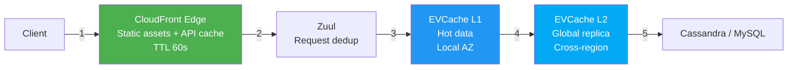

| Layer | Hit Rate | Latency | Scope |
|-------|----------|---------|-------|
| CDN Edge (CloudFront) | ~30 % for API | < 10 ms | Global PoPs |
| EVCache L1 (local AZ) | ~95 % of remaining | < 1 ms | Per-AZ |
| EVCache L2 (cross-region) | ~99 % cumulative | < 5 ms | Per-region |
| Database | ~1 % of original | 5–20 ms | Cassandra cluster |

**Effective DB load reduction: ~99.5 %**

### 7.2 Horizontal Scaling Axes

| Component | Scaling Mechanism | Trigger |
|-----------|-------------------|---------|
| Zuul | Auto-scaling group + CloudFront | CPU > 60 % or RPS threshold |
| Microservices | AWS ASG / Titus (Netflix container platform) | CPU, latency P99, queue depth |
| Cassandra | Add nodes (virtual nodes for rebalance) | Disk > 50 %, read latency P99 > 10 ms |
| EVCache | Shard splitting | Memory > 75 % |
| Kafka | Add partitions + brokers | Consumer lag > threshold |
| Open Connect OCAs | Deploy more appliances to ISPs | Capacity planning based on subscriber growth models |
| Elasticsearch | Add data nodes, cross-cluster | Indexing lag, search latency |

### 7.3 Content-Aware Traffic Steering

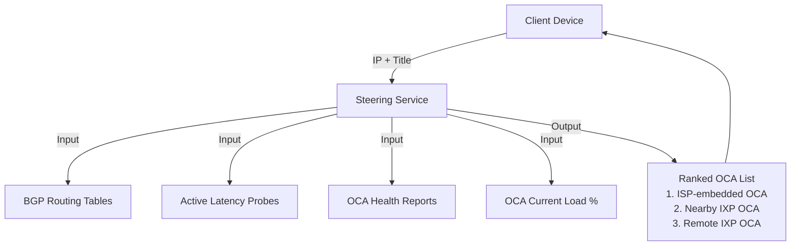

The steering service returns an **ordered list** of OCAs. The client tries them in order, failing over automatically if one is slow or unreachable.

---

## 8. Reliability & Fault Tolerance

### 8.1 Failure Modes & Mitigations

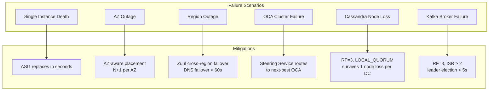

### 8.2 Circuit Breaker Pattern (Hystrix / Resilience4j)

Every inter-service call is wrapped:

```
Timeout:        1 s (browse), 3 s (playback)
Circuit opens:  Error rate > 50 % over 20 s window
Fallback:       Cached / degraded response (e.g., generic recommendations)
Bulkhead:       Thread pool per dependency → one slow service can't exhaust all threads
```

### 8.3 Chaos Engineering Program

| Tool | Scope | Frequency |
|------|-------|-----------|
| Chaos Monkey | Kill random instances | Continuous (business hours) |
| Chaos Kong | Simulate full region failure | Monthly |
| FIT (Failure Injection Testing) | Inject latency / errors into specific services | On-demand per team |
| ChAP (Chaos Automation Platform) | Automated experiments with statistical analysis | Weekly |

### 8.4 Regional Failover

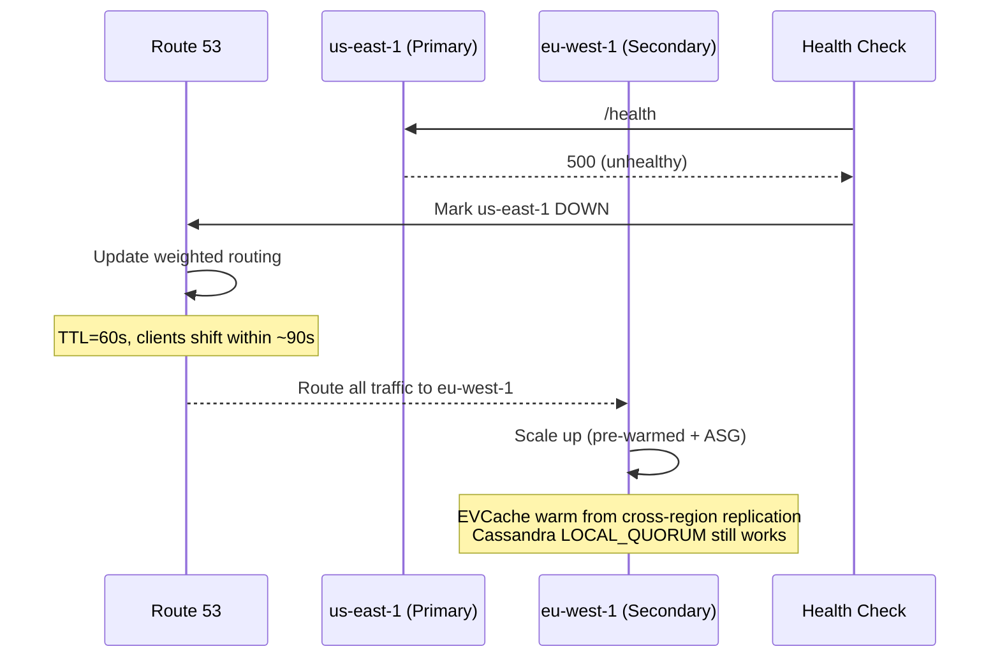

---

## 9. Observability

### 9.1 Three Pillars

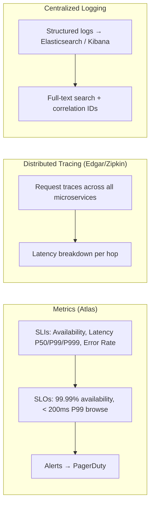

### 9.2 Key SLIs / SLOs

| SLI | SLO | Burn Rate Alert |
|-----|-----|-----------------|
| Availability (non-5xx responses) | 99.99 % / 30 days | 14.4× in 1 hr → page |
| Browse latency P99 | < 200 ms | > 300 ms for 5 min → page |
| Playback start P99 | < 2 s | > 3 s for 5 min → page |
| Stream rebuffer ratio | < 0.5 % | > 1 % for 10 min → page |
| Rec model freshness | < 6 hr | > 12 hr → warn |

---

## 10. Security

### 10.1 Defense in Depth

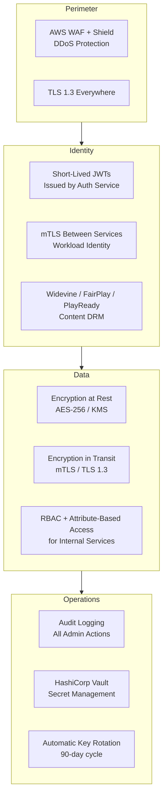

### 10.2 Content Protection

| Layer | Mechanism |
|-------|-----------|
| Encryption | AES-128 CTR per segment; key rotation per title |
| DRM | Multi-DRM: Widevine (Android/Chrome), FairPlay (Apple), PlayReady (Windows) |
| Watermarking | Forensic watermarking per-session to trace leaks |
| Device attestation | Verify Widevine L1 / FairPlay hardware TEE before granting HD/4K license |

---

## 11. Cost Considerations

| Cost Center | Strategy |
|-------------|----------|
| **CDN / Egress** | Open Connect eliminates ~95 % of third-party CDN cost; ISPs host OCAs for free (mutual benefit) |
| **Compute** | Titus container platform on reserved instances + spot for batch; auto-scale aggressively |
| **Storage** | S3 Intelligent-Tiering for master vault; OCA local SSD (owned hardware, amortized) |
| **Transcoding** | Per-title encoding reduces encoded variants that need storage/delivery |
| **Data transfer** | Multi-region async replication (not synchronous) reduces cross-region transfer |
| **Caching** | EVCache reduces DB queries by 99.5 % → fewer Cassandra nodes needed |

---

## 12. Interview Talking Points

### Staff-Level Signals to Hit

| Signal | How to Demonstrate |
|--------|--------------------|
| **Scope & ambiguity management** | Start with two-plane split (control vs. data plane) — shows you decompose the problem before diving in |
| **Trade-off articulation** | ADRs with rejected alternatives (e.g., Cassandra vs. DynamoDB, self-CDN vs. third-party) |
| **Depth where it matters** | Per-title encoding, OCA steering algorithm, EVCache cross-region invalidation |
| **Operational maturity** | Chaos engineering, SLO burn-rate alerts, circuit breakers with fallbacks |
| **Cost awareness** | Open Connect ROI, caching hit-rate math, reserved vs. spot compute |
| **Security-first thinking** | Multi-DRM, mTLS service mesh, forensic watermarking |
| **Cross-team influence** | Platform team provides Zuul, Eureka, Hystrix, Titus — you articulate how platform enables product velocity |

### Common Follow-Up Questions & Answers

**Q: How do you handle a new show launch (e.g., Squid Game Season 3) with massive spike?**
> Pre-warm EVCache with pre-computed recs. Proactively fill all OCAs globally (not just popular regions). Scale Zuul + playback service 2× ahead of launch. Use traffic shaping in steering to spread load across OCA clusters. Have a "big red button" to disable non-critical features (e.g., skip-intro animation) to shed load.

**Q: How do you ensure consistency of viewing history across devices?**
> Cassandra with LOCAL_QUORUM writes; async cross-region replication. Playback heartbeats every 30 s write position. On resume, read with LOCAL_QUORUM to get latest. Conflict: last-write-wins by timestamp is acceptable — user watches on one device at a time. If truly concurrent, show "Continue Watching?" prompt.

**Q: What happens when an entire AWS region goes down?**
> Zuul detects via health checks. Route 53 weighted routing shifts traffic within ~90 s. Target region has pre-warmed capacity (N+2 headroom). Cassandra + EVCache have cross-region replicas — reads served locally. Stateless services just need more instances. Open Connect is unaffected (independent of AWS). Practiced monthly via Chaos Kong.

**Q: How would you evolve this system for live streaming?**
> Replace pre-encoded files with real-time encoding pipeline (low-latency CMAF). Use LL-HLS/LL-DASH for < 5 s glass-to-glass latency. OCAs become live edge caches (not pre-filled). Add WebSocket channel for live chat/reactions. Steering must account for real-time origin proximity, not just cached content location.

---

## References

- [Netflix Tech Blog](https://netflixtechblog.com/) — Primary source for architecture details
- [Open Connect Overview](https://openconnect.netflix.com/) — CDN architecture and ISP program
- [Netflix OSS](https://netflix.github.io/) — Zuul, Eureka, Hystrix, EVCache, Conductor
- [Completing the Netflix Cloud Migration (2016)](https://about.netflix.com/en/news/completing-the-netflix-cloud-migration)
- [How Netflix Works with ISPs](https://about.netflix.com/en/news/how-netflix-works-with-isps-around-the-globe-to-deliver-a-great-viewing-experience)
- [Netflix Chaos Engineering](https://netflixtechblog.com/tagged/chaos-engineering)
- [Per-Title Encode Optimization](https://netflixtechblog.com/per-title-encode-optimization-7e99442b62a2)
- [EVCache at Netflix](https://netflixtechblog.com/announcing-evcache-distributed-in-memory-datastore-for-cloud-c26a698c27f7)
